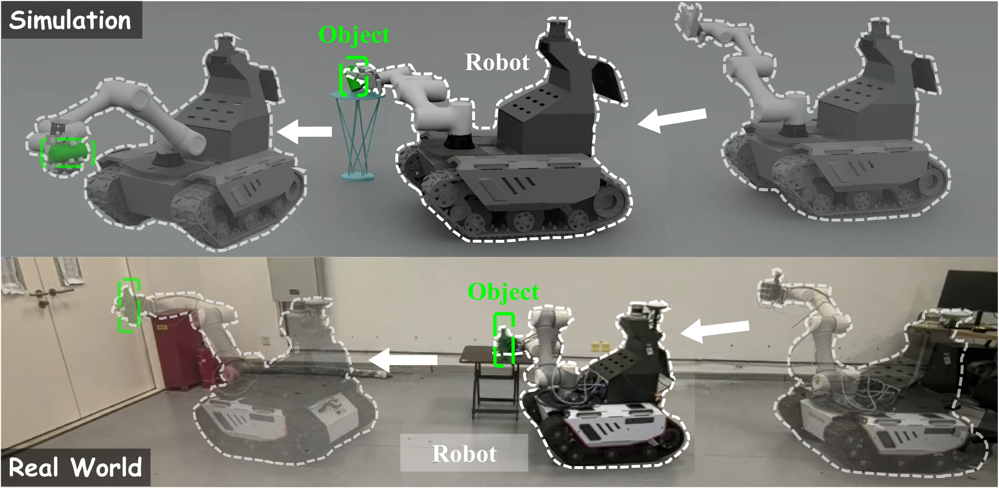

# [FastGrasp: Learning-based Whole-body Control method for Fast Dexterous Grasping with Mobile Manipulators](https://taoheng-star.github.io/fastgrasp-page/)
Preprint of [FastGrasp](https://arxiv.org/abs/2604.12879). 

<div style="display: flex; align-items: center;">
    
</div>

<p align="justify">
We propose FastGrasp, a learning-based framework that integrates grasp guidance, whole-body control, and tactile feedback for mobile fast grasping. Our two-stage reinforcement learning strategy first generates diverse grasp candidates via conditional variational autoencoder conditioned on object point clouds, then executes coordinated movements of mobile base, arm, and hand guided by optimal grasp selection. Tactile sensing enables real-time grasp adjustments to handle impact effects and object variations.
</p>

## News

- **2026-04-14**: Release the simulation training scripts and references.


## Pipeline
<div style="display: flex; align-items: center;">
    
</div>
<div style="text-align: justify;">
FastGrasp adopts a two-stage strategy to achieve fast dexterous grasping for mobile manipulators: in the first stage, a conditional variational autoencoder (CVAE) conditioned on object point clouds generates diverse grasp candidates, and the optimal grasp guidance is selected based on hand envelopment metrics (GWC and GDC); in the second stage, this grasp guidance, together with real-time tactile feedback, is used to train a whole-body control policy via reinforcement learning (PPO), coordinating the mobile base, robotic arm, and dexterous hand to achieve stable grasping under high-speed motion while adapting to objects of varying shapes.
</div>


## Installation
- Create conda environment and install pytorch:
```
conda create -n fastgrasp python=3.10
conda activate fastgrasp
pip install torch==2.5.1 torchvision==0.20.1 torchaudio==2.5.1 --index-url https://download.pytorch.org/whl/cu124
```

- Download Isaacsim:
You can refer to this [link](https://isaac-sim.github.io/IsaacLab/v2.0.1/source/setup/installation/pip_installation.html).
```
pip install --upgrade pip
pip install isaacsim[all,extscache]==4.5.0 --extra-index-url https://pypi.nvidia.com
isaacsim
```

- Install Isaac Lab:
You can refer to this [link](https://isaac-sim.github.io/IsaacLab/v2.0.1/source/setup/installation/pip_installation.html).
```
git clone git@github.com:isaac-sim/IsaacLab.git
# cd IsaacLab file
sudo apt install cmake build-essential
./isaaclab.sh --install
```

- To allow for different table heights in different parallel environments,The following code needs to be added before the `spawn_multi_usd_file` return operation.
```
#gedit ~/IsaacLab-2.0.1/source/isaaclab/isaaclab/sim/spawners/wrappers/wrappers.py
# add following code before the `spawn_multi_usd_file` return operation
if hasattr(cfg, 'randshape'):
    rand_num = cfg.randshape
    for idx,rand in enumerate(rand_num):
        usd_cfg = usd_template_cfg.replace(usd_path=usd_paths[0])
        usd_cfg.scale[2] *= rand
        multi_asset_cfg.assets_cfg.append(usd_cfg)
# You can set the table height in tasks/quicf_grasp.py file.
```

- Install skrl:
```
pip install skrl==1.4.3
```

- Install GenDexGrasp:
You can refer to this [link](https://github.com/tengyu-liu/GenDexGrasp)


## Training/Testing Settings
- You can configure the model and agent parameters in the iqr_bunker_grasp_skrl_ppo_cfg.yaml.
```
models:
  separate: False
  policy:  # see gaussian_model parameters
    class: GaussianMixin
    clip_actions: False
    clip_log_std: True
    min_log_std: -20.0
    max_log_std: 2.0
    initial_log_std: 0.0
    network:
      - name: net
        input: STATES
        layers: [1024,512,512,256, 128, 128, 128, 64, 64]
        activations: elu
    output: ACTIONS
  value:  # see deterministic_model parameters
    class: DeterministicMixin
    clip_actions: False
    network:
      - name: net
        input: STATES
        layers: [1024,512,512,256, 128, 128, 128, 64, 64]
        activations: elu
    output: ONE
```

- Training and Inference
```
# Training
python scripts/skrl_train.py --num_envs 48 --video False (--headless)  

# Inference
 python scripts/skrl_play.py --num_envs 1 --video False --checkpoint best_agent.pt 
```
num_envs: Number of parallel environments, default 48.  
video: Record videos during training.  
headless: Headless operation.  


## Citation

Please consider citing our paper if you find this repo useful:
```bibtex
@misc{tao2026fastgrasplearningbasedwholebodycontrol,
      title={FastGrasp: Learning-based Whole-body Control method for Fast Dexterous Grasping with Mobile Manipulators}, 
      author={Heng Tao and Yiming Zhong and Zemin Yang and Yuexin Ma},
      year={2026},
      eprint={2604.12879},
      archivePrefix={arXiv},
      primaryClass={cs.RO},
      url={https://arxiv.org/abs/2604.12879}, 
}
```
# LICENSE
This project is licensed under the MIT License - see the [LICENSE](LICENSE) file for details.
